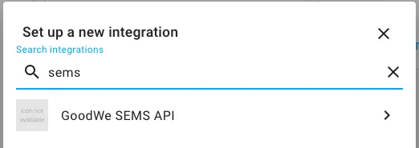
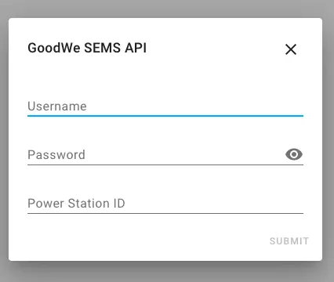

# GoodWe SEMS API integration for Home Assistant

Integration for Home Assistant that retrieves PV data from GoodWe SEMS API.


### NB!: This is a Beta version!


## Setup

### Easiest install method via HACS

[](https://github.com/custom-components/hacs)

The repository folder structure is compatible with [HACS](https://hacs.xyz) and is included by default in HACS.

Install HACS via: https://hacs.xyz/docs/installation/manual.
Then search for "SEMS" in the Integrations tab (under Community).

### Manual Setup

Crude sensor for Home Assistant that scrapes from GoodWe SEMS portal. Copy all the files in `custom_components/sems/` to `custom_components/sems/` your Home Assistant config dir.

## Configure integration

The required ID of your Power Station can be retrieved by logging in to the SEMS Portal with your credentials:
https://www.semsportal.com

After login you'll see the ID in your URL, e.g.:
https://semsportal.com/PowerStation/PowerStatusSnMin/12345678-1234-1234-1234-123456789012

In this example the ID of the Power Station is: 12345678-1234-1234-1234-123456789012

In the home assistant GUI, go to `Configuration` > `Integrations` and click the `Add Integration` button. Search for `GoodWe SEMS API`.

Fill in the required configuration and it should find your inverters.

Note that changed to `configuration.yaml` are no longer necessary and can be removed.


### Extra (optional) templates to easy access data as sensors
Replace `$NAME` with your inverter name.
```yaml
  - platform: template
    sensors:
      pv_outputpower:
        value_template: '{{ states.sensor.inverter_$NAME.attributes.outputpower }}'
        unit_of_measurement: 'W'
        friendly_name: "PV Power output"
      pv_temperature:
        value_template: '{{ states.sensor.inverter_$NAME.attributes.tempperature }}'
        unit_of_measurement: 'C'
        friendly_name: "PV Temperature"
      pv_eday:
        value_template: '{{ states.sensor.inverter_$NAME.attributes.eday }}'
        unit_of_measurement: 'kWh'
        friendly_name: "PV energy day"
      pv_etotal:
        value_template: '{{ states.sensor.inverter_$NAME.attributes.etotal }}'
        unit_of_measurement: 'kWh'
        friendly_name: "PV energy total"
      pv_iday:
        value_template: '{{ states.sensor.inverter_$NAME.attributes.iday }}'
        unit_of_measurement: '€'
        friendly_name: "PV income day"
      pv_itotal:
        value_template: '{{ states.sensor.inverter_$NAME.attributes.itotal }}'
        unit_of_measurement: '€'
        friendly_name: "PV income total"
      pv_excess:
        value_template: '{{ states.sensor.inverter_$NAME.attributes.pmeter }}'
        unit_of_measurement: 'W'
        friendly_name: "PV spare"
      # battery soc
      pv_soc:
        value_template: '{{ states.sensor.inverter_$NAME.attributes.soc }}'
        unit_of_measurement: '%'
        friendly_name: "Battery power"
```

## Screenies






## Debug info

Add the last line in `configuration.yaml` in the relevant part of `logger`:

```yaml
logger:
  default: info
  logs:
    custom_components.sems: debug
```

## Notes

* Sometimes the SEMS API is a bit slow, so time-out messages may occur in the log as `[ERROR]`. The component should continue to work normally and try fetch again the next minute.

## Credits

Inspired by https://github.com/Sprk-nl/goodwe_sems_portal_scraper and https://github.com/bouwew/sems2mqtt .
Also supported by generous contributions by various helpful community members.